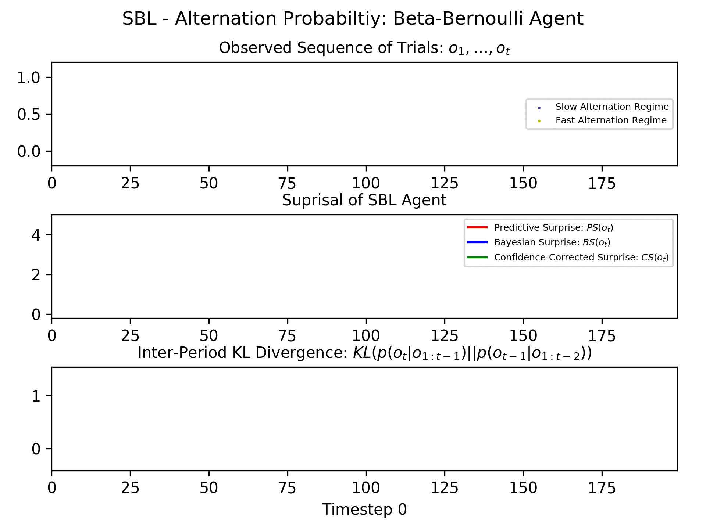

# Sequential Bayesian Learning
## Author: Robert Tjarko Lange
## Date: October 2018

Repository implements different Sequential Bayesian Learning Agents which parse a binary sequence. The binary sequence was previously generated by a Hierarchical Hidden Markov Model.
As the agent parses the individual elements of the sequence she updates her posterior and calculates surprisal measures (Predictive, Bayesian and Confidence-Corrected):



The agents include the following:

* Beta-Bernoulli (BB) agent
* Gaussian Random Walk (GRW) agent
* Gaussian Hierarchical Filter (GHF) agent

The models include the following:

* [x] BB agent modeling the stimulus probability (SP)
* [x] BB agent modeling the alternation probability (AP)
* [x] BB agent modeling the transition probability (TP)

TODO:
* [ ] GRW agent modeling the stimulus probability (SP)
* [ ] GRW agent modeling the alternation probability (AP)
* [ ] GRW agent modeling the transition probability (TP)
* [ ] GHF agent modeling the stimulus probability (SP)
* [ ] GHF agent modeling the alternation probability (AP)
* [ ] GHF agent modeling the transition probability (TP)

## Repository Structure
```
SequentialBayesianLearning
+- mmn_seq_gen.py: Contains HHMM that samples a binary sequence.
+- mmn_sbl.py: Contains Beta-Bernoulli learner for different models
+- visualize: Runs gif visualization of learning
+- results: contains result images
+- README.md: Project Documentation
+- requirements.txt: list of all required pip packages
```

## How to use this code
1. Clone the repo.
```
git clone https://github.com/RobertTLange/SequentialBayesianLearning && cd SequentialBayesianLearning
```
2. Create a virtual environment (optional but recommended).
```
virtualenv -p python SBL
```
Activate the env (the following command works on Linux, other operating systems might differ):
```
source SBL/bin/activate
```
3. Install all dependencies:
```
pip install -r requirements.txt
```
4. Run the different sequential learning agents (e.g. for a seq with length 200):
```
python mmn_sbl.py -model SP
python mmn_sbl.py -model AP
python mmn_sbl.py -model TP
```
