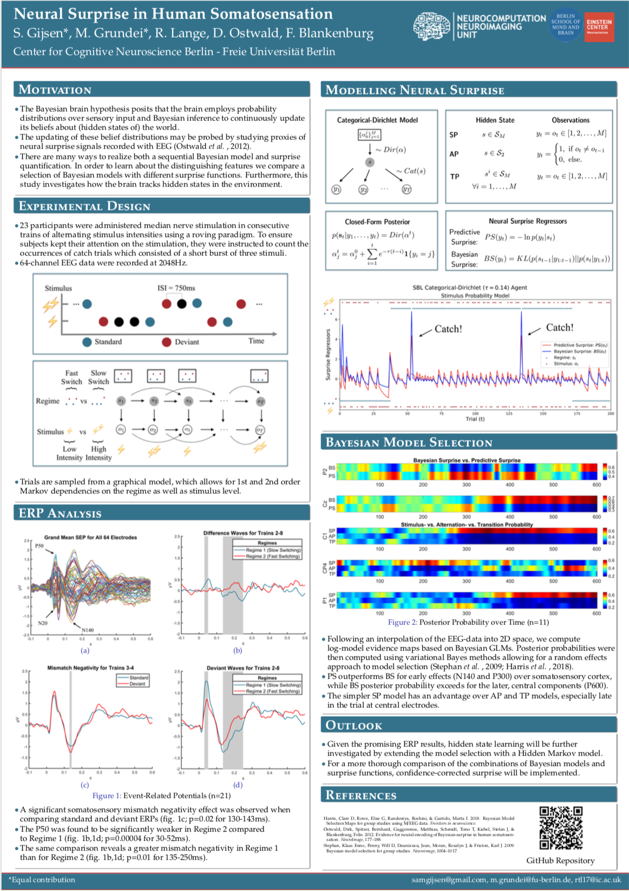

# Sequential Bayesian Learning
## Author: Robert Tjarko Lange, Miro Grundei, Sam Gijsen
## Date: February 2019

Repository implements different Sequential Bayesian Learning Agents which parse a binary sequence. The binary sequence was previously generated by a Graphical Model. For a detailed description and example execution please view [the workspace notebook](workspace.ipynb).

For a more formal report and technical details, please view the [write up](report/background.pdf). Otherwise check out our [Mind Brain Body Symposium Poster](report/MBB_Poster_2019.pdf) from March 2019:




## Repository Structure
```
SequentialBayesianLearning
├── figures: Store plots
├── report: Write up and presentations
├── results: Surprise regressors and modeling results
├── sampling: Files for generating the trial sequences
    +- seq_gen.py: Samples sequence according to graphical model
    +- seq_analysis.py: Analyze the sampled sequence - get empirical stats
├── sbl_agents: Different sequential bayesian learning agents
    +- sbl_cat_dir: Categorical-Dirichlet SBL agent
    +- sbl_hmm: Hidden Markov Model Agent
├── utils: Helper files
    +- helpers.py: Define helper functions for loading files, visualization and post-processing
├── .gitignore: jadajada
├── README.md: Documentation
├── requirements.txt: Dependencies
├── run_in_parallel.txt: Run trial-by-trial analysis in parallel from command line
├── workspace.ipynb: Main workspace - Check it out!
```

## How to use this code
1. Clone the repo.
```
git clone https://github.com/RobertTLange/SequentialBayesianLearning && cd SequentialBayesianLearning
```
2. Create a virtual environment (optional but recommended).
```
virtualenv -p python SBL
```
Activate the env (the following command works on Linux, other operating systems might differ):
```
source SBL/bin/activate
```
3. Install all dependencies:
```
pip install -r requirements.txt
```
4. Run the main workspace notebook:
```
jupyter notebook workspace.ipynb
```


## Running the individual scripts
1. Sample a sequence from the Graphical Model and saves it to .mat file
    * 1st order Markov sequence of length 800 with following probabilities:
    ```
    pythonw seq_gen.py -t 1st_temp -reg_init 0.5 -reg_change 0.01 -catch 0.05 -obs_init 0.5 -obs_change 0.35 0.65 0.65 0.35 -order 1 -v -seq
    800
    ```
    * 2nd order Markov sequence of length 800 with following probabilities:
    ```
    pythonw seq_gen.py -t 1st_temp -reg_init 0.5 -reg_change 0.01 -catch 0.05 -obs_init 0.5 -obs_change 0.35 0.65 0.65 0.35 -order 2 -v -seq
    800
    ```

    * Arguments to all seq_gen.py files - Sampling parameters:
        - '-reg_init', '--prob_regime_init', default=0.5: Initial regime probability
        - '-reg_change', '--prob_regime_change', default=0.01: Probability of changing regime
        - '-obs_init', '--prob_obs_init', default=0.5: Initial regime probability
        - '-obs_change','--prob_obs_change': Probability of changing regime
        - '-catch', '--prob_catch', default=0.05: Probability of changing regime
        - '-seq', '--sequence_length', default=200: Length of binary sequence being processed
        - '-order', '--markov_order', default=1: Markov dependency on observation level

    * Arguments to all seq_gen.py files - Output parameters:
        - '-t', '--title', default="temporary_sample_title": Title of file which stores sequence'
        - '-matlab', '--mat_file_out', default=True: Save output as a .mat file
        - '-p', '--plot_seq', default=False: View/Plot the sampled sequence
        - '-v', '--verbose': Get status printed out
2. Run Categorical Dirichlet Surprise Models/SBL Agents
```
pythonw sbl_cat_dir.py -file S1_800 -S -model SP
```
