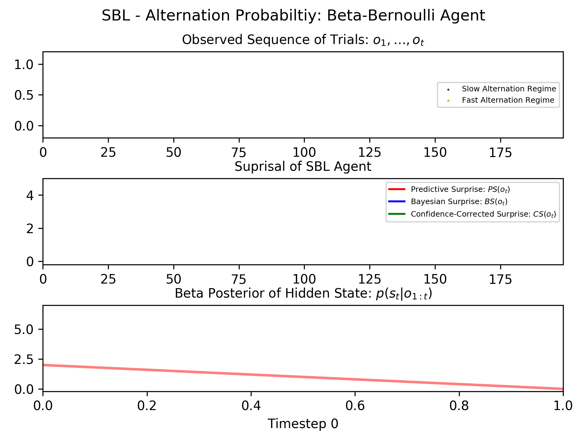

# Sequential Bayesian Learning
## Author: Robert Tjarko Lange, Miro Grundei, Sam Gjisem
## Date: November 2018

Repository implements different Sequential Bayesian Learning Agents which parse a binary sequence. The binary sequence was previously generated by a Graphical Model.


An example sequence is given below:


As the agent parses the individual elements of the sequence she updates her posterior and calculates surprisal measures (Predictive, Bayesian and Confidence-Corrected):



## Repository Structure
```
SequentialBayesianLearning
+- seq_gen.py: Samples sequence according to graphical model
+- seq_analysis.py: Analyze the sampled sequence - get empirical stats
+- pics: contains visualizations of results
+- results: contains txt files with suprisal/sequence
+- README.md: Project Documentation
+- requirements.txt: list of all required pip packages
```

## How to use this code
1. Clone the repo.
```
git clone https://github.com/RobertTLange/SequentialBayesianLearning && cd SequentialBayesianLearning
```
2. Create a virtual environment (optional but recommended).
```
virtualenv -p python SBL
```
Activate the env (the following command works on Linux, other operating systems might differ):
```
source SBL/bin/activate
```
3. Install all dependencies:
```
pip install -r requirements.txt
```
4. Sample a sequence from the Graphical Model and saves it to .mat file
    * 1st order Markov sequence of length 800 with following probabilities:
        * Catch: $p(o_t = "catch") = 0.05$
        * Regime switch: $p(s_t \neq s_{t-1}) = 0.01$
        * Regime 0:
            * $p(o_t = 0|o_{t-1}=0, s_t=0) = 0.35 - 0.05/2 - 0.01/2$
            * $p(o_t = 1|o_{t-1}=0, s_t=0) = 0.65 - 0.05/2 - 0.01/2$
        * Regime 1:
            * $p(o_t = 0|o_{t-1}=0, s_t=1) = 0.65- 0.05/2 - 0.01/2$
            * $p(o_t = 1|o_{t-1}=0, s_t=1) = 0.35- 0.05/2 - 0.01/2$
    ```
    pythonw seq_gen.py -t 1st_temp -reg_init 0.5 -reg_change 0.01 -catch 0.05 -obs_init 0.5 -obs_change 0.35 0.65 0.65 0.35 -order 1 -v -seq
    800
    ```

    * 2nd order Markov sequence of length 800 with following probabilities:
        * Regime 0: $p(o_t = 0|o_{t-1}=0, o_{t-1}=0) = 0.35, p(o_t|o_{t-1}) = 0.65$
        * Regime 1: $p(o_t = 0|o_{t-1}=0) = 0.65, p(o_t|o_{t-1}) = 0.35$
    ```
    pythonw seq_gen.py -t 1st_temp -reg_init 0.5 -reg_change 0.01 -catch 0.05 -obs_init 0.5 -obs_change 0.35 0.65 0.65 0.35 -order 2 -v -seq
    800
    ```

* Arguments to all seq_gen.py files - Sampling parameters:
    - '-reg_init', '--prob_regime_init', default=0.5: Initial regime probability
    - '-reg_change', '--prob_regime_change', default=0.01: Probability of changing regime
    - '-obs_init', '--prob_obs_init', default=0.5: Initial regime probability
    - '-obs_change','--prob_obs_change': Probability of changing regime
    - '-catch', '--prob_catch', default=0.05: Probability of changing regime
    - '-seq', '--sequence_length', default=200: Length of binary sequence being processed
    - '-order', '--markov_order', default=1: Markov dependency on observation level

* Arguments to all seq_gen.py files - Output parameters:
    - '-t', '--title', default="temporary_sample_title": Title of file which stores sequence'
    - '-matlab', '--mat_file_out', default=True: Save output as a .mat file
    - '-p', '--plot_seq', default=False: View/Plot the sampled sequence
    - '-v', '--verbose': Get status printed out
